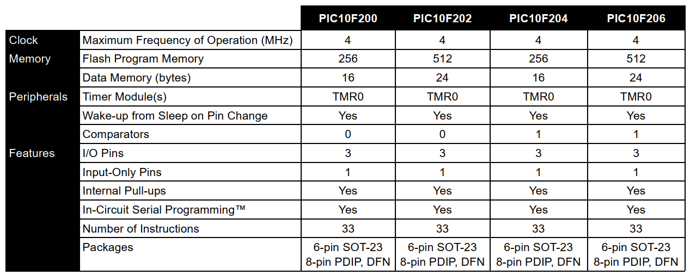
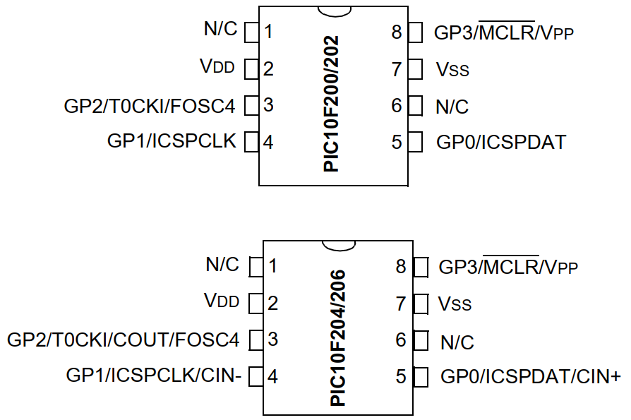
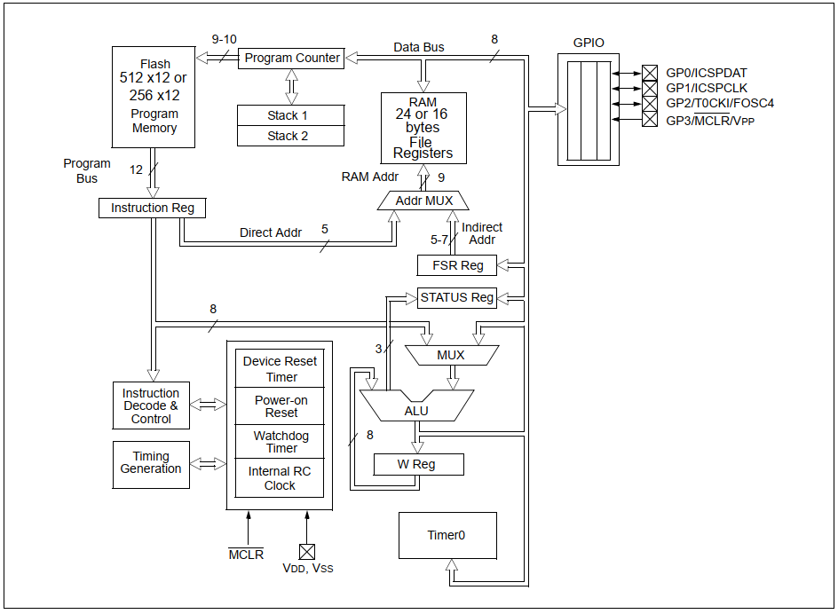
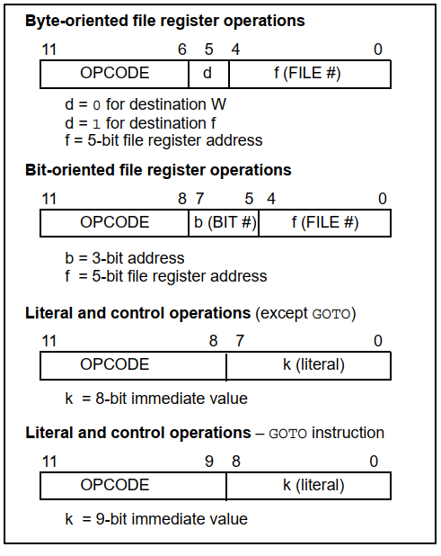
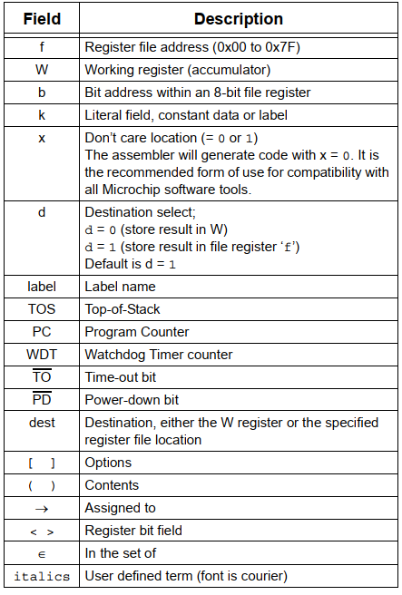

# Diseño de arquitectura de PIC10F200 en Verilog

Autores:
1. Julisa Verdejo Palacios
2. Jose David Rodríguez Muñoz
3. Oscar Iván Ramírez Medina
4. Eduardo Juárez Mendoza

## 1. Características del PIC

El PIC10F200 es un dispositivo de bajo costo, alto rendimiento, de 8 bits, con memoria Flash basada en CMOS desarrollado por Microchip Technology. Este microcontrolador emplea una arquitectura **RISC** (Reduce Instruction Set Computing). El conjunto de instrucciones es fácil de usar y fácil de recordar lo cual reduce significativamente el tiempo de desarrollo.

Estos dispositivos utilizan una arquitectura **Harvard** en donde el acceso al programa y la memoria de datos es por buses separados. Esto aumenta el ancho de banda sobre arquitecturas tradiciones de von Neumann donde el programa y la memoria de datos utilizan el mismo bus.

### 1.1. Especificaciones

* Cuenta con 33 instrucciones de palabra simple (Single-Word).
* Todas las instrucciones toman un ciclo de instrucción excepto las instrucciones de salto que toman dos ciclos.
* Las instrucciones son de 12 bits de ancho.
* Cuenta con un stack en hardware de 2 niveles de profundidad.
* El ancho del data path es de 8 bits. 
* 8 registros de de función especial en hardware.
  * INDF, TMR0, PCL, STATUS, FSR, OSCCAL, GPIO, CMCONC0
* 16 registros de propósito general.
* Velocidad de operación
  * Reloj interno de 4 MHz.
  * Ciclo de instrucción de 1 microsegundo. 

### 1.2. Periféricos

* Cuenta con 4 pines I/O:
  * 3 pines I/O con control individual de dirección.
  * 1 pin de solo lectura.
* Contador de 8 bits (TMR0) con prescalador programable de 8 bits. 
* Un comparador:
  * Referencia de voltaje absoluta interna.
  * Ambas entradas del comparador externamente visibles.
  * Salida del comparador externamente visible.

### 1.3. Resumen de especificaciones

En la Tabla 1 se muestran las pequeñas variaciones que hay en los distintos PICs de la familia 10F. Estas son:

* Mayor memoria de programa (Flash).
* Mayor memoria de datos.
* Comparador opcional.


**Tabla 1: Comparación de especificaciones, extraída de [1]**.

### 1.4. Diagrama de pines

En la Figura 1 se muestra el diagrama de pines PDIP (Plastic Dual In-Line Package) del PIC. La única variación que hay entre los diferentes PICs de esta familia es que los pines 3,4,5 se pueden configurar como comparador si se tiene disponible, de otra manera se utilizan como entradas o salidas. Se tienen dos pines para la alimentación, 2 y 7 respectivamente y los pines 1 y 6 no se utilizan. El pin 8 se puede configurar únicamente como entrada de ser necesario o funciona normalmente como reset.


**Figura 1: Pinout, extraído de [1]**.

### 1.5. Aplicaciones

Los dispositivos PIC10F200 se adaptan a aplicaciones que van desde dispositivos de cuidado personal y sistemas de seguridad hasta transmisores/receptores remotos de baja potencia. La tecnología Flash hace que la personalización de los programas de aplicación sea extremadamente rápida y cómoda. Su empaquetado de tamaño reducido hace que estos microcontroladores sean ideales para aplicaciones con limitaciones de espacio. El bajo costo, bajo consumo de energía, alto rendimiento, facilidad de uso y flexibilidad de I/O hacen que sean muy versátiles incluso en áreas donde no se ha considerado antes el uso de microcontroladores (funciones de temporizador, lógica y PLD en sistemas más grandes y aplicaciones de coprocesador).

### 1.6. Data path


**Figura 2: Data Path, extraído de [1]**.

### 1.7. Organización de la memoria de datos

La memoria de datos esta organizada en el mapa de registros de la Figura 3. Las direcciones están es hexadecimal y van desde 00h hasta 1Fh. Las primeras 8 direcciones de la memoria de datos esta reservada para algunos de los registros de función especial, los cuales son: 

* **INDF:**  Indirect Data Addresing.
* **TMR0:** Este registro se utiliza para el funcionamiento del periférico contador de 8 bits.   
* **PCL:** Registro de contador de programa (Program Counter). Almacena la dirección de la próxima instrucción a ejecutarse en la memoria de programa. El valor del Program Counter se incrementa en uno cada ciclo de instrucción, a menos que una instrucción cambie su valor.
* **STATUS:** Este registro contiene el estado de la aritmética del ALU. Por ejemplo, en este registro el bit **DC** que indica cuando ocurre un desbordamiento en las operaciones de suma y resta.
* **FSR**: (File Select Register). Se utiliza en combinación con el registro INDF para hacer direccionamiento indirecto.
* **OSCCAL:** Registro de calibración del oscilador. Es utilizado para calibrar la precisión interna del oscilador de 4 MHz, Contiene 7 bits de calibración. El valor de calibración debe leerse antes de borrar el dispositivo para que pueda programarse correctamente posteriormente.
*  **GPIO:** Solo los últimos 4 bits de este registro se utilizan. GP0, GP1,GP2 se pueden configurar como estradas o salidas utilizando el registro TRIS (Tristate register), GP3 puede configurarse solo como entrada. El registro GPIO nos permite leerlo para conocer el estado de las entradas de los pines o modificarlo para poner a 1 o 0 los pines configurados como salida.
* **CMCONC0:** Este registro controla la operación del comparador.

**Figura 3: Mapa de registros de la memoria de datos, extraído de [1].**

### 1.8. Memoria del programa


**Figura 4: Memoria del programa, extraído de [1].**

### 1.9 Set de instrucciones

Las instrucciones del PIC se dividen en tres categorías básicas:

* Operaciones orientadas a byte.
* Operaciones orientadas a bit.
* Operaciones de literal y control.

Cada instrucción del PIC se divide en dos partes, el **opcode**, el cual especifica el tipo de instrucción y un **operando**.


**Figura 5: Mapa de registros de la memoria de datos, extraído del datasheet [1].**



**Tabla 2: Descripción de campos de opcode, extraído del datasheet [1]**


## 3. Arquitectura básica


**Figura 6: Datapath de arquitectura básica**

## 4. Códigos

1. [divisor_de_frecuencia](divisor_de_frecuencia.md)
2. [ram](ram.md)
3. [w_reg](w_reg.md)
4. [instruction_reg](instruction_reg.md)
5. [program_counter](program_counter.md)
6. [alu_mux](alu_mux.md)
7. [program_counter_mux](program_counter_mux.md)
8. 


## 5. Implementación en FPGA

Se va a utilizar la tarjeta Basys3 que tiene las siguientes caracteristicas:

- Oscilador de 100 MHz
- Artix-7 XC7A35T1CPG236C
- 33,280 logic cells en 5200 slices (each slice contains four 6-input LUTs and 8 flip-flops)
- 16 user switches
- 16 user LEDs

```plain
## Clock signal
set_property -dict { PACKAGE_PIN W5   IOSTANDARD LVCMOS33 } [get_ports clk]

## Switches
set_property -dict { PACKAGE_PIN V17   IOSTANDARD LVCMOS33 } [get_ports {rst}]

## LEDs
set_property -dict { PACKAGE_PIN U16   IOSTANDARD LVCMOS33 } [get_ports {slow_clk}]
```

## 6. Definiciones

1. **Program Memory (Flash):** Es la memoria donde se guardan todas las instrucciones que se van a ejecutar en el microcontrolador, se mide en palabras (Words). Otra manera de verlo es como el código escrito por el programador convertido a hexadecimal el cual posteriormente se va a ejecutar. En el PIC10F200 es de 256x12 palabras. Cada instrucción es de 12 bits.
2. **Data Memory (SRAM):** Es la memoria que el programador tiene disponible para almacenar valores que se utilizarán dentro del código a ejecutar. Por ejemplo, el resultado de una suma se puede almacenar en alguno de los registros del data memory. En el PIC10F200 se tienen 16x8 registros disponibles. El PIC es un microcontrolador de 8 bits.
3. **Ciclo de instrucción:** Es la cantidad de ciclos de reloj que le toma al microcontrolador ejecutar una sola instrucción, en el caso del PIC10F200 son 4 ciclos de reloj. Como opera a 4 MHz cada instrucción toma 1 microsegundo, es decir (1/ 4 MHz)*4.
4. **GPIO:**  General Purpose Input/Output.
5. **PLD:** Programable Logic Devices.

## 7. Referencias

1. Datasheet del PIC en el siguiente [enlace](https://ww1.microchip.com/downloads/aemDocuments/documents/OTH/ProductDocuments/DataSheets/40001239F.pdf).
2. Implementación del PIC10F200 en verilog por John Gulbrandsen en el siguiente [enlace](http://www.summitsoftconsulting.com/pic10ipcore.htm).
3. Implementación del PIC16F628A en verilog por kiwih en el siguiente [enlace](https://github.com/kiwih/pic16f-antastic).
4. Implementación del PIC16F84 en verilog por pawlex en el siguiente [enlace](https://github.com/pawlex/hdl.verilog.ipcore.pic.risc16f84).
5. Implementación del PIC16F628 en verilog por JeckSmit en el siguiente [enlace](https://github.com/JeckSmit/pic16f628).
6. Implementación del PIC16F1826 en verilog por OnlyAoiKunie en el siguiente [enlace](https://github.com/OnlyAoiKunie/PIC16f1826).
7. Implementación del PIC16C57 en verilog por hsyhsw en el siguiente [enlace](https://github.com/hsyhsw/PIC16C57).
8. Implementación del PIC16C5x en verilog por Michael A. Morris en el siguiente [enlace](https://github.com/MorrisMA/PIC16C5x).
9. Implementación del PIC16C84 en verilog por JeckSmit en el siguiente [enlace](https://github.com/JeckSmit/verilog-cpu-pic16C84).
10. Implementación del PIC16F84 en verilog por PJEstrada en el siguiente [enlace](https://github.com/PJEstrada/pic-16f84-verilog).
11. Implementación del PIC16F84 en verilog por sumio-morioka en el siguiente [enlace](https://github.com/sumio-morioka/cqpic).
12. Single Port RAM Intel [enlace](https://www.intel.com/content/www/us/en/support/programmable/support-resources/design-examples/horizontal/ver-single-port-ram.html)
13. Single Port RAM Xilinx [enlace](https://docs.xilinx.com/r/en-US/ug901-vivado-synthesis/Single-Port-Block-RAM-with-Resettable-Data-Output-Verilog)
14. ALU de 4 bits para realizar 8 operaciones lógicas [enlace](https://programmerclick.com/article/8145851218/).
15. Verilog code for a simple ALU [enlace](https://verilogcodes.blogspot.com/2015/10/verilog-code-for-simple-alu.html).
16. Simple Flip-flop implementation [enlace](https://www.fpga4student.com/2017/02/verilog-code-for-d-flip-flop.html).
17. Archivo de restricciones para FPGA Basys3 [enlace](https://github.com/Digilent/digilent-xdc/blob/master/Basys-3-Master.xdc)
